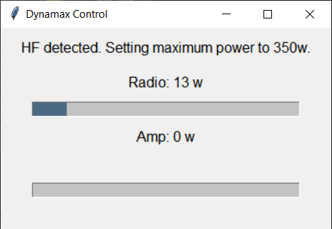

# Dynamax

Automatically keep the output of a KPA500 within a certain range when using the amp with a Flex radio.

## The Problem Dynamax Solves

I have a Flex 6400, a KPA500, a EFHW-8010-2K-Plus antenna for 10m-80m, and a dipole for 6m. The endfed antenna cannot take more than 350w in digital modes. For that hard to reach DX on FT8 or FT4, I like to run the maximum power possible. However, the actual power out of the amp differ across bands for the same amount of power into the amp, and the power out even fluctuates sometimes on the same band, and I don't want to have to make constant one or two watt adjustments to the power coming out of the radio to stay near the max without exceeding it. (Especially helpful using the Band Hopping capability in WSJT-X Improved.)

## How It Solves the Problem

Dynamax keeps the power coming out of the amp within a certain range. (The default is between 330 and 350 watts.) Dynamax monitors messages the Flex and KPA500 broadcast over the network, and automtically adjusts the radio's power output in real-time based on the power out of the amp.

## What You'll Need

Beyond a Flex radio and a KPA500, you'll need to be running the KPA500 Remote software, which broadcasts the amp's status. You'll also need Python installed on the computer where you want to run Dynamax. The included batch file assumes you're using [Anaconda](https://www.anaconda.com/download) for this.

## Getting Started

To get started, you'll need to change the IP addresses of the radio and the amp in dynamax.py.
